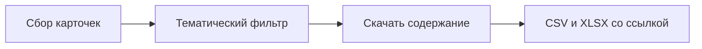

# Содержание документов рядом с выгрузкой

Сейчас в таблицу попадает только карточка (название, даты, ссылка на портал). Нужно для строк **уже попавших в выгрузку** сохранить файлы/текст отдельно и дать кликабельную ссылку в таблице.

Скачивать до фильтра нельзя: неделя regulation без отбора — сотни файлов. Сначала список и ключевые слова, потом файлы только у прошедших отбор.



## Куда класть файлы

Рядом с таблицей, чтобы относительный путь не ломался при переносе папки:

```
out/
  npa_07082026-13082026.csv
  npa_07082026-13082026.xlsx
  npa_07082026-13082026_content/
    regulation/170252/Проект_правил.docx
    cbr/12345/article.html
    sozd/1234567-8/bill.html
```

Колонка **Содержание** — относительный путь от каталога выгрузки (например `npa_…_content/regulation/170252/файл.docx`). В XLSX — гиперссылка openpyxl, в CSV — тот же путь текстом. Нет файла — пустая ячейка, прогон не падает.

## Как доставать содержание

Общий модуль `[src/npa_monitor/content.py](src/npa_monitor/content.py)`: безопасное имя файла, запись байт, вызов `fetch_content(doc, dest_dir)` у источника. У каждого источника свой `Fetcher` (маршруты `direct`/`proxy` как сейчас).

**regulation.gov.ru** — проверено в браузере на карточке `170252`:

- этапы: `GET /api/public/PublicProjects/GetProjectStages/{id}`
- у этапа «Текст проекта» есть `file.fileId` и `file.description` (имя `.docx`)
- скачивание: `GET /api/public/Files/GetFile/{fileId}` → `application/octet-stream`

Берём файлы со всех непустых этапов (текст, принятый документ). В колонку — файл этапа «Текст», иначе первый найденный.

**cbr.ru** — карточка уже есть в `url` (`/press/event/?id=` или `/news/`). Сохраняем HTML статьи. Если в тексте есть прямые ссылки на `.pdf`/`.docx` на `cbr.ru` — качаем их в ту же папку; в колонку — PDF, если есть, иначе HTML.

**sozd.duma.gov.ru** — страница `https://sozd.duma.gov.ru/bill/{номер}` (уже в `url`). Парсим HTML: ссылки на вложения (pdf/doc/docx/rtf). Нет вложений — снимок страницы в `.html`. Маршрут `sozd` с прокси не меняем.

Сбой одной карточки: лог и пустая колонка.

## Правки кода

- `[src/npa_monitor/models.py](src/npa_monitor/models.py)`: поле `content_path`, колонка `Содержание` сразу после `Ссылка`.
- `[src/npa_monitor/export.py](src/npa_monitor/export.py)`: в XLSX гиперссылка на относительный путь.
- `[src/npa_monitor/runner.py](src/npa_monitor/runner.py)`: после фильтра, до `to_csv`/`to_xlsx`, обойти `collected` и заполнить `content_path`. Ключ `--no-content` (и чекбокс в GUI) — пропуск скачивания.
- `[src/npa_monitor/http.py](src/npa_monitor/http.py)`: GET бинарника тем же `_request` (уже есть).
- Источники: функция `fetch_content(doc, folder: Path) -> Path | None`.
- `[.gitignore](.gitignore)`: `out/*_content/`.
- README: что лежит в папке, что колонка — локальный файл, не URL портала.

Фильтр по ключевым словам по-прежнему по заголовку. Разбор PDF в текст — вне скоупа.

После реализации — прогон `--sources regulation --no-filter` на короткие даты: в таблице путь, файл открывается. Пересборка `.exe`.