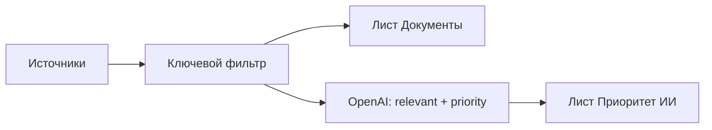

# ИИ-фильтрация и приоритет (OpenAI)

Сейчас пайплайн такой: источники → ключевые слова из [`config.yaml`](config.yaml) → один лист «Документы» в CSV/XLSX. GUI таблицы документов не показывает. ИИ встраивается **вторым шагом**: исходный список не трогаем, поверх него строится новая таблица.



## Поведение

- Сбор и ключевой фильтр — как сейчас (флаг «без тематического фильтра» тоже остаётся).
- Если ИИ включён: каждый документ (заголовок, тип, статус, ведомство, источник, уже сработавшие темы/слова) уходит в OpenAI пакетами.
- Модель для каждого документа возвращает:
  - `relevant` — оставить / отбросить (ложные срабатывания вроде «отпуск» не по теме)
  - `priority` — 1–5 (5 = прямо по направлениям из `config.yaml`: МФО/кредитование, ИТ, ИБ, труд, охрана труда)
  - `reason` — короткое обоснование на русском
- В выгрузку ИИ попадают только `relevant=true`, сортировка: приоритет по убыванию, затем дата публикации по убыванию.
- Если ключа нет или API недоступен при включённом ИИ — ошибка с понятным текстом; исходный лист всё равно пишется, чтобы сбор не пропал.

Критерии приоритета задаются системным промптом + список направлений из `config.yaml` (не хардкод тем в коде).

## Новый модуль [`src/npa_monitor/ai.py`](src/npa_monitor/ai.py)

Без SDK `openai`: проект уже на `requests`, а PyInstaller-exe от SDK раздуется. Вызов:

`POST https://api.openai.com/v1/chat/completions`

- `response_format: json_schema` (strict) — стабильный JSON без « pensé ».
- Пакеты по ~25 карточек (настраивается).
- Таймаут отдельный от порталов (например 90 с), 2–3 ретрая на пакет.
- Ключ и модель только из окружения, в код не попадают.

Ответ валидируется: все `id` пакета на месте, `priority` в 1–5; битый пакет — повтор, затем пометка в логе и пропуск (документ не попадает в ИИ-таблицу).

## Модель и экспорт

В [`src/npa_monitor/models.py`](src/npa_monitor/models.py) у `Document` появятся поля `ai_priority`, `ai_reason` (пустые, пока ИИ не вызывали).

[`src/npa_monitor/export.py`](src/npa_monitor/export.py):

- Лист **Документы** — без изменений (те же колонки).
- Лист **Приоритет ИИ** — те же колонки + `Приоритет` + `Обоснование ИИ`, только отфильтрованные и уже отсортированные строки.
- CSV: как сейчас `npa_{период}.csv` + второй файл `npa_{период}_priority.csv`.

## Пайплайн и UI

[`src/npa_monitor/runner.py`](src/npa_monitor/runner.py): после ключевого фильтра, если `use_ai=True`, вызвать ранжирование, записать оба листа, в лог — сколько осталось после ИИ.

[`src/npa_monitor/__main__.py`](src/npa_monitor/__main__.py): флаг `--ai`.

[`src/npa_monitor/gui.py`](src/npa_monitor/gui.py): чекбокс «Отфильтровать и ранжировать через OpenAI» в блоке «Выгрузка». В диалоге успеха — число в исходной таблице и в таблице приоритета.

Таблица в самом окне Tkinter не добавляется: «новая таблица» = второй лист Excel / второй CSV, как сейчас устроена выгрузка.

## Конфиг и сборка

[`.env.example`](.env.example):

```
OPENAI_API_KEY=
OPENAI_MODEL=gpt-4o-mini
# OPENAI_BASE_URL=https://api.openai.com/v1   # только если нужен шлюз
```

[`config.yaml`](config.yaml):

```yaml
ai:
  batch_size: 25
```

[`requirements.txt`](requirements.txt) не меняется (остаётся `requests`).

[`npa-monitor.spec`](npa-monitor.spec): `hiddenimports` + `npa_monitor.ai`.

[`README.md`](README.md): короткий раздел — ключ в `.env`, флаг/чекбокс, что ИИ смотрит только карточки (заголовок), не PDF; из РФ `api.openai.com` может быть недоступен (тогда `OPENAI_BASE_URL` на свой шлюз).

## Ограничения, которые явно оставляем

- Текст акта / PDF по-прежнему не скачивается — ИИ ранжирует по карточке, как и ключевой фильтр.
- ИИ по умолчанию выключен, чтобы обычная выгрузка не требовала ключа и не тратила токены.
